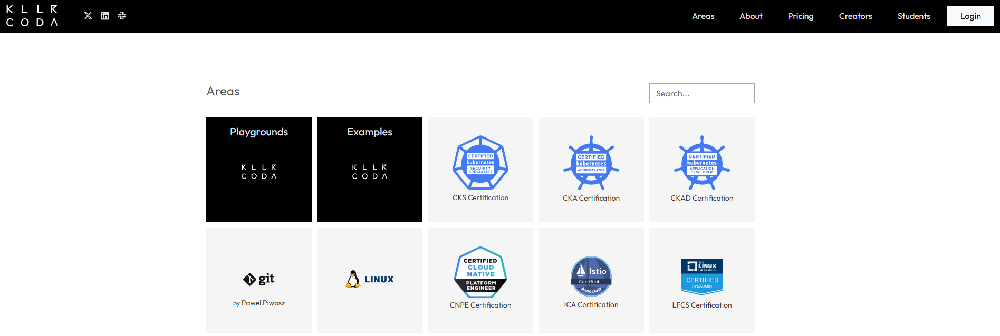
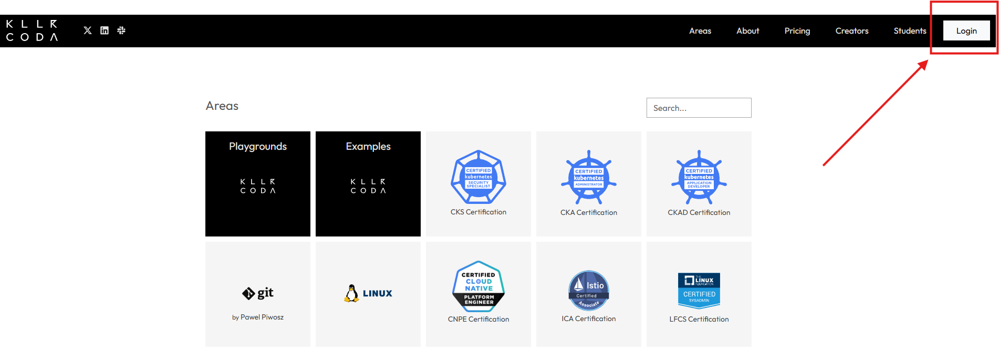
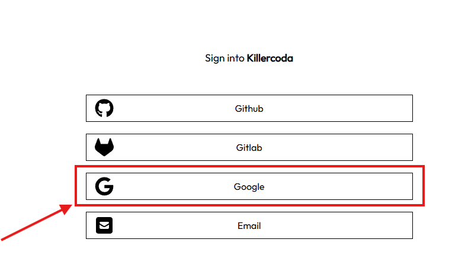
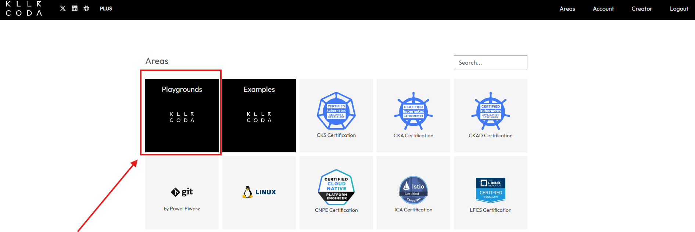
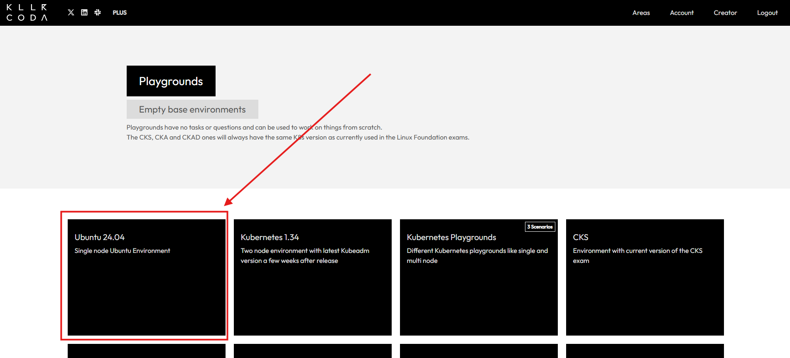
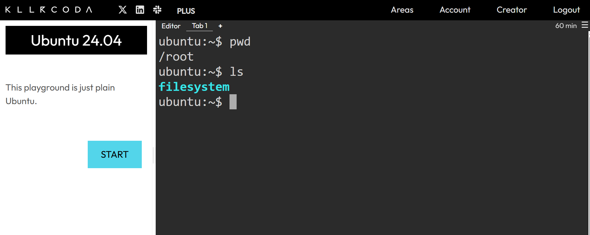
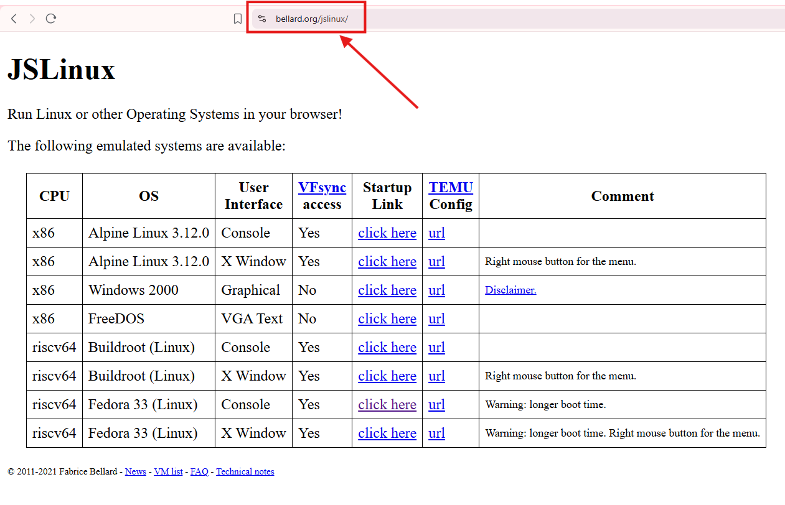
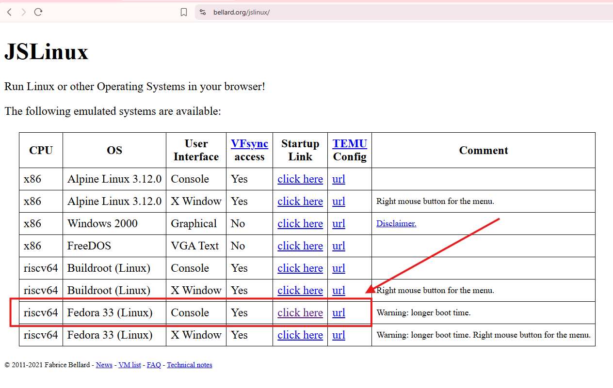
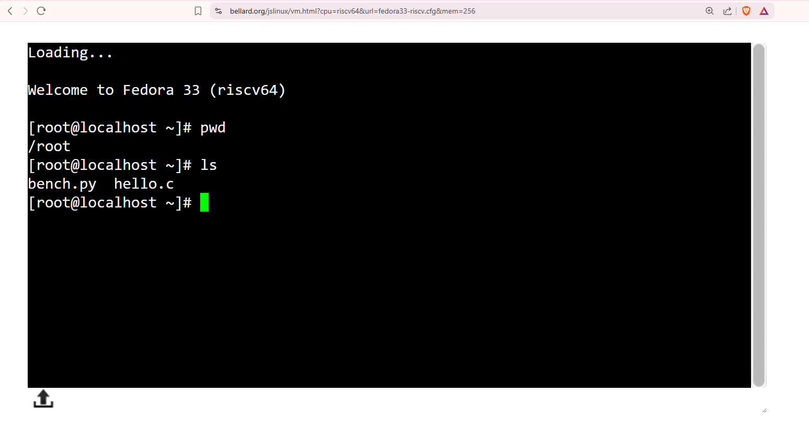

# Free Platforms to Practice Linux Online 

## 1. Killercoda

1. Open your browser and go to:
   **[https://killercoda.com/](https://killercoda.com/)**

2. Login using the **Login with Google** option available at the top-right corner. Use your Gmail to Login.

3. Click on **Playgrounds**.

4. Select **Ubuntu 24.04**.

5. The Linux terminal will open in your browser.
   You can now start practicing Linux commands.

---

## 2. Bellard (JSLinux)

1. Open your browser and go to:
   **[https://bellard.org/jslinux/](https://bellard.org/jslinux/)**

2. From the available options, click on:
   **riscv64 – Fedora 33 (Linux)**

4. The Linux console will load directly in your browser.

5. You can now practice Linux commands without any installation.

---

✅ These platforms are ideal for hands-on Linux practice anytime, anywhere.
**कर्म ही पूजा है** 🙏
